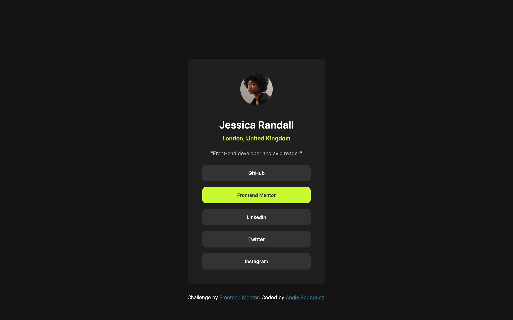

# Frontend Mentor - Social links profile solution

This is my solution to the [Social links profile challenge on Frontend Mentor](https://www.frontendmentor.io/challenges/social-links-profile-UG32l9m6dQ). Frontend Mentor challenges help you improve your coding skills by building realistic projects.

## Table of contents

- [Overview](#overview)
  - [The challenge](#the-challenge)
  - [Screenshot](#screenshot)
  - [Links](#links)
- [My process](#my-process)
  - [Built with](#built-with)
  - [What I learned](#what-i-learned)
  - [Continued development](#continued-development)
  - [Useful resources](#useful-resources)
- [Author](#author)

## Overview

### The challenge

Users should be able to:

- See hover and focus states for all interactive elements on the page

### Screenshot
Desktop View



### Links

- [Solution URL](https://github.com/ARodriguezHacks/social-links-profile)
- Live Site URL: [Add live site URL here](https://your-live-site-url.com)

## My process

### Built with

- Semantic HTML5 markup
- CSS
  - Custom properties (a.k.a., variables)
  - Native nesting
  - Transitions
  - Flexbox
- Mobile-first workflow

### What I learned

The main learning goals I set for myself were: 1) to write cleaner code, and 2) begin approaching projects in a more organized fashion.

More specifically, I was interested in gaining practice with existing and newer CSS innovations. These included the `@font-face` at-rule (I'd always imported my fonts using the `@import` at-rule) and more notably native CSS nesting.

I'm particularly proud of the CSS code below because it combines some new things I had yet to experience, mostly the opportunity to use nesting without a preprocesser (e.g., Sass).

```css
main {
.../** code commented out for readability*/
  & button {
    background: var(--color-neutral-grey);
    color: var(--color-neutral-white);
    padding: 15px;
    border-style: hidden;
    border-radius: 10px;
    font-weight: bold;
    transition: all 0.25s linear;

    &:not(:last-child) {
      margin-bottom: 16px;
    }

    &:hover {
      background: var(--color-primary);
      color: var(--color-neutral-grey);
      cursor: pointer;
    }
  }
.../** code commented out for readability*/
}
```

### Continued development

Areas I'd like to practice for future and similar projects include:
- Accessibility within HTML and CSS
- BEM and other CSS writing best practices
- Container queries

### Useful resources

- [CSS Transitions](https://developer.mozilla.org/en-US/docs/Web/CSS/CSS_transitions/Using_CSS_transitions) - Helpful resource I always refer to when creating CSS transitions.
- [BEM Naming Convention](https://css-tricks.com/bem-101/) - I'm still gaining practice with this approach because it's not easy for me to remember, but I try to approach my CSS class namings and HTML structuring from the teachings laid out in this article.

## Author

- Frontend Mentor - [@ARodriguezHacks](https://www.frontendmentor.io/profile/ARodriguezHacks)
